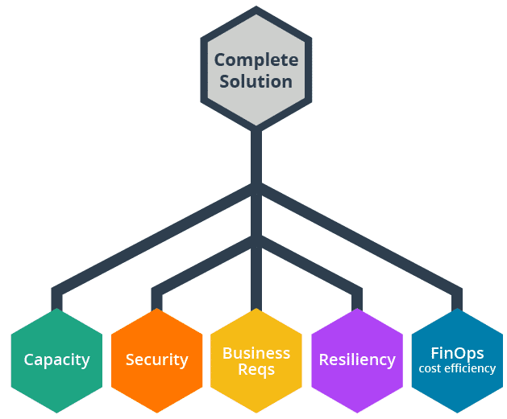

# Introduction (1/11)

- [Why You're Here](#why-youre-here)
  - [Welcome](#welcome)
- [What is FinOps](#what-is-finops)
  - [Introduction to FinOps](#introduction-to-finops)
  - [Financial Accountability](#financial-accountability)
  - [Usage Optimization & Rate Optimization](#usage-optimization--rate-optimization)
  - [Bringing In FinOps](#bringing-in-finops)
- [Why it Matters](#why-it-matters)
  - [Why Do FinOps?](#why-do-finops)
  - [FinOps Matters](#finops-matters)

---

## Why You're Here

### Welcome
- FinOps enables innovation by creating financial insights that empower engineers to make informed decisions throughout the entire development lifecycle.

## What is FinOps

### Introduction to FinOps
- Cloud FinOps is an evolving cloud financial management discipline and cultural practice.

### Financial Accountability
- Due of the widespread use of cloud, SaaS and PaaS products, DevOps and Agile, engineers are the ones developing the systems that make companies money.
    - **As an engineer, you are increasingly entrusted with the authority to commit the company to spending in the public cloud, and you will increasingly be expected to deliver greater value for that spending.**

### Usage Optimization & Rate Optimization
- At a fundamental level, cloud spend is the product of usage and rates **(usage x rate = cost)**. A key objective of FinOps teams is to promote both cost avoidance (related to usage) and cost optimization (related to rates). 
- *FinOps teams will focus on both:*
    - **Usage optimization**: ensuring resources in the cloud are only running when they are being used
    - **Rate optimization**: ensuring we pay the least we need to for the resources that we decide we need to be running at any given time.
- **As engineers, you play a pivotal role in usage optimization by avoiding unnecessary costs through architecting and building systems considering cost as a first class requirement.**
- When architecting, you can optimize by taking time to find the best architecture fit for your purpose by using the right mix of services to solve the right business problems. 
    - You can optimize running systems to ensure they are operating efficiently, only running when necessary, scaling appropriately to their workloads at any given time, and cleaning up after themselves by deleting resources as they shut down.

### Bringing In FinOps
- The FinOps team and all other personas are on the journey together to financial awareness.
- The FinOps team will support collaboration and coordinate many of the activities needed to support a FinOps practice.

- FinOps is built on the following six guiding principles:
    1. **Teams need to collaborate**. Public cloud brings new challenges and all teams can provide useful information and viewpoints.
    1. **Everyone takes ownership of their cloud usage**. This may be the most impactful principle to your work. You have the power to create resources in the cloud directly. So, in addition to working to meet technical requirements of the systems you build (e.g. uptime or resiliency), you will increasingly be required to meet financial requirements as well. FinOps will help ensure you have access to the information you need to build systems that satisfy your customers' performance needs and your company's profitability requirements. 
    1. **A centralized team drives FinOps**. There will be tasks that your central FinOps team takes on: commitments and reservations, rate negotiations, policy and strategy, and even some automation and scripting. You can always ask this team for help when needed. 
    1. **Reports should be accessible and timely**. The FinOps team will be responsible for providing you and everyone with information on which to base decisions and guide actions. You have the opportunity to make this information as useful as you can by participating in information gathering, asking questions and providing feedback.
    1. **Decisions are driven by business value of cloud**. Using Agile and DevOps principles as well as using SaaS and cloud services means being able to innovate and build faster than ever. This means decisions need to be made faster than ever too and more people need to have visibility across finance, engineering, leadership and other teams. These decisions have to be based on a combination of cost, features, speed, quality, technical merit, and overall value -- not just focused on cost reduction. Organizations are looking to get the most value out of their cloud spending, which doesn't always mean spending less. Make sure you understand the value of what you are building and discuss this with all necessary stakeholders.
    1. **Take advantage of the variable cost model of the cloud**. It is the variable cost model and variable usage model with cloud that makes FinOps necessary in the first place. Being able to use a wide variety of resources in creative ways and only running them when needed creates the biggest net advantage to those adopting agile public cloud software development. However, every running resource adds cost, so you must always have a plan to turn off things in the cloud when they are not needed. You don't pay for what you use in the cloud, you pay for what is running whether you use it or not. 

## Why it Matters

### Why Do FinOps?
- An excellent benefit of doing FinOps as an engineer is **cost efficiency**.
    - Cost efficiency awareness demonstrates a level of cloud maturity and individual responsibility and increasingly contributes to the bottom line of the company directly.
    - The accurate awareness of cloud costs and trends tends to improve the relationship with other personas. This leads to an increase in trust and an ability to increase innovation.
    - Building in cost efficiency not only gives you tools to save the company money, it also allows you to free up funds that you can use for innovation, experimentation, automation, etc.

### FinOps Matters
- Engineers aiming to build a complete solution need all of the insights and data to understand the implications of the decisions they make. **FinOps matters in the same way security, resiliency, business requirements, and capacity matter.** You need to know all of the parts in order to problem solve and build a complete solution. Complete solutions are built when all parts are considered.

    
